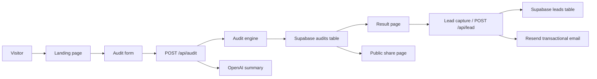

# Architecture

AI Spend Audit is built with a clean separation of concerns:

- `app/` contains page routes and global layout.
- `components/` houses reusable UI patterns and page-specific sections.
- `lib/` provides low-level integrations, helpers, and platform clients.
- `services/` encapsulates business logic for auditing, validation, and data access.
- `tests/` validates audit engine behavior.

## High-level architecture

## Key components

- `audit-engine.ts` executes vendor rule checks and savings calculations.
- `ai-client.ts` generates personalized summaries via OpenAI.
- `resend.ts` sends transactional emails securely.
- `share.ts` provides public-safe audit retrieval.

## Data flow

1. User submits tool spend form.
2. `/api/audit` validates input, computes recommendations, generates a summary, and stores the report.
3. The results page loads the audit and shows tailored savings insights.
4. The lead capture form captures contact details and stores a lead record.
5. Public share pages reuse audit data without exposing email or company details.
